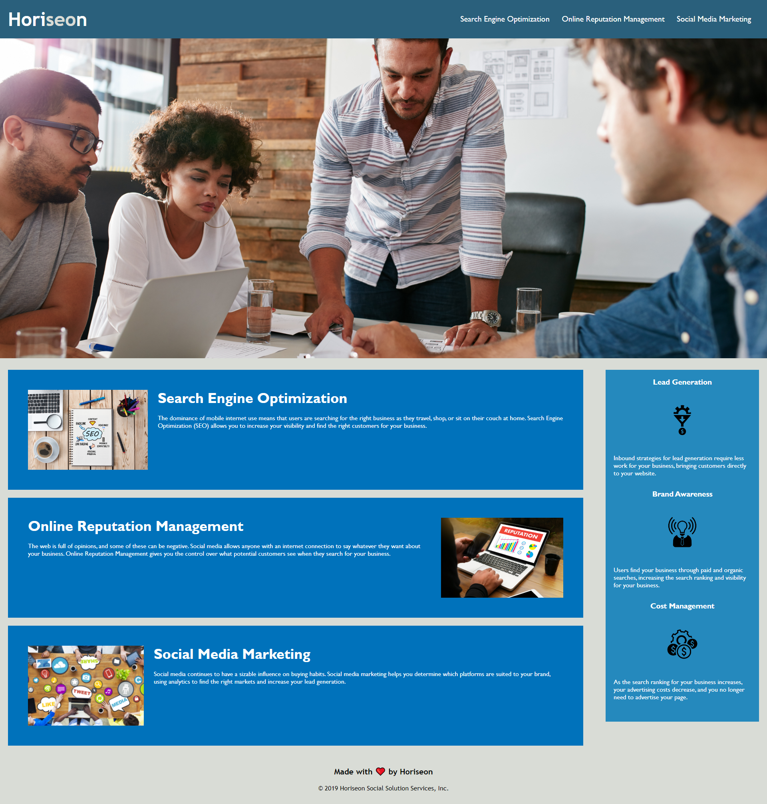

# Horiseon Accessability Optimisation

## Description

This project is to refactor the codebase of the Horiseon webpage to employ accessibility standards and optimized for search engines, along with ensuring the codebase is easy to update and maintain. This meant consolidating selectors and properties and organising them to follow the semantic structure of the HTML elements. Comments have also been added to clearly outline elements and sections of the page. One div tag and span tag remain, to allow flexibility of including an alt tag for the background image and alternate colour of SEO in Horiseon in the header.

## Updates made

* Added descriptive title
* HTML semantic elements were used to replace div tag where possible
* Included id in Search Engine Optimization to ensure the Nav link worked
* Included a hover for the Nav links to make it apparent they were clickable links
* Added alt text for all images in the main sections and aside sections
* Rearranged CSS selectors to match flow of HTML elements
* Consolidated CSS selectors to reduce number of HTML elements
* Comments added to HTML and CSS files to outline purpose of each section and associated styles

## Screenshot

## Links

* [Horiseon opmitization](https://rhjeffries.github.io/Horiseon-Accessability-Optimisation/)
* [Github repo](https://github.com/RHJeffries/Horiseon-Accessability-Optimisation)

## Credits

Assistance with CSS hover selector and object fit were from W3 schools references

* [CSS hover Selector](https://www.w3schools.com/cssref/sel_hover.asp)
* [CSS Object-fit](https://www.w3schools.com/css/css3_object-fit.asp)
